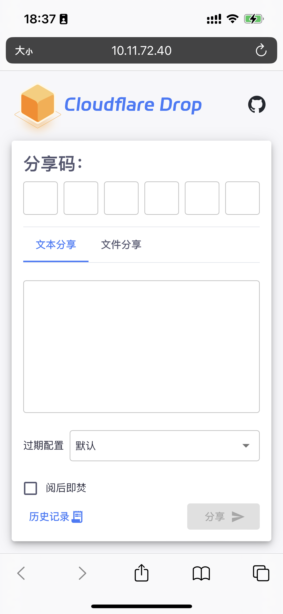
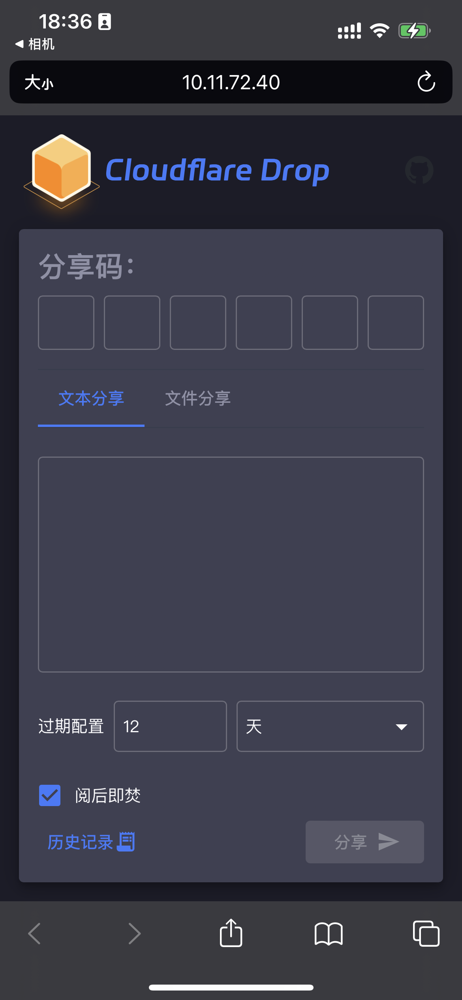
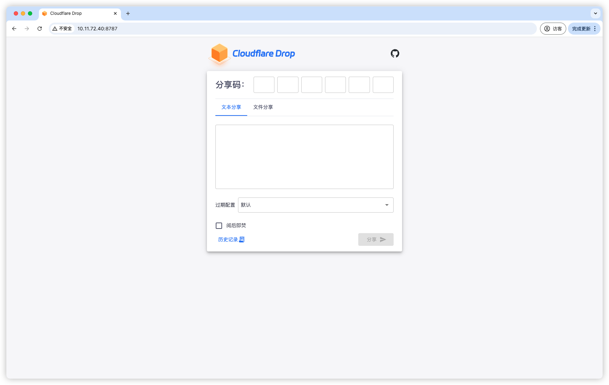
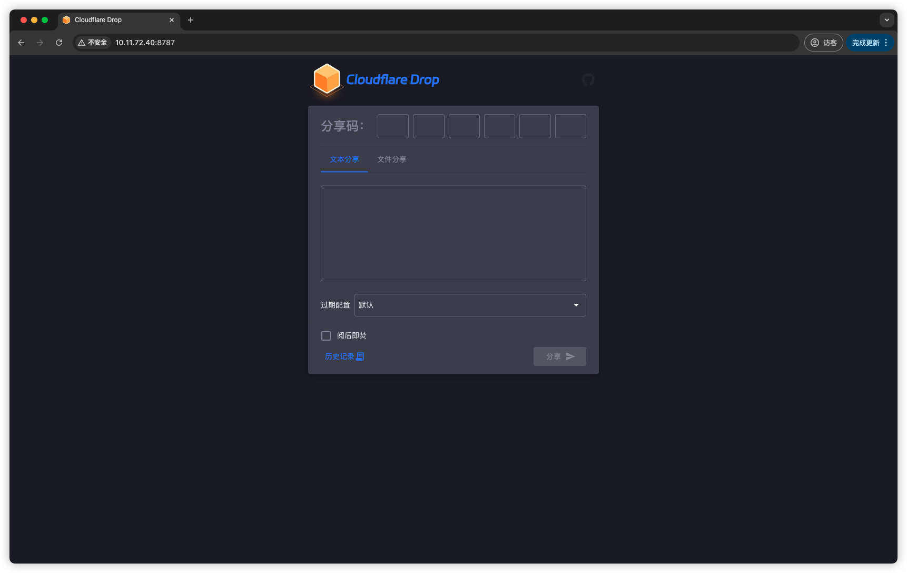
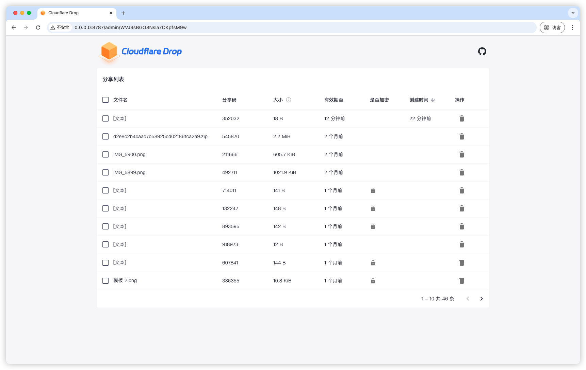

# Cloudflare Drop

基于 Cloudflare Worker、D1Database 和 KV 实现的轻量级文件分享工具。

## 自动部署

1. 点击按钮，跳转到自动部署页面
2. 根据页面指引，关联 GitHub & Cloudflare，配置 Cloudflare Account ID & API Key
3. Fork 仓库
4. 开启 Action
5. 部署

> 创建 Cloudflare API Key 时，如果使用 worker 模板创建，请记得添加 D1 的编辑权限。

## 更新

同步 Fork 的仓库即可自动更新 & 构建。

## 配置 GitHub Action Secret

1. 在初次部署完成后，还需要创建 [D1Database](https://developers.cloudflare.com/d1/get-started/#2-create-a-database) & [KV](https://developers.cloudflare.com/kv/get-started/#2-create-a-kv-namespace)，参考对应文档。
2. 配置 Secret：在 forked 的仓库 -> **Settings** -> **Secrets and variables** -> **Actions** -> **New repository secret**
3. 配置以下 Secret：
   - CUSTOM_DOMAIN （可选，域名，如 drop.example.cn）
   - D1_ID (D1Database ID)
   - D1_NAME (D1Database Name)
   - KV_ID (KV Namespace ID)
4. 重新运行 Github Actions

## 其他配置

### 文件大小限制

默认文件限制为 10M，可以通过添加 Action 变量来修改。

新增 `SHARE_MAX_SIZE_IN_MB` Action 变量，值为最大允许的 MB 数字，例如 20，配置路径：在 forked 的仓库 -> **Settings** -> **Secrets and variables** -> **Actions** -> **New repository variable**

### 分享过期时间配置

分享默认有效期是一个小时，可以通过添加 Action 变量来修改。

新增 `SHARE_DURATION` Action 变量，配置格式为 `数值+单位`，比如 (5minute)，支持的单位有 `minute`, `hour`, `day`, `week`, `month`, `year`

### 新增 IP 上传频率限制

默认无限制，可以通过添加 Action 变量来修改。

新增 `RATE_LIMIT` Action 变量，值为每 10s 可请求数，比如 10

## 过期清理

Worker 添加了一个 10 分钟的定时任务，自动清理过期的 KV 存储和 D1 中的记录。

## 后台管理

通过配置 ADMIN_TOKEN Secret，可以访问管理后台：`https://your.drop.com/admin/{ADMIN_TOKEN}`， 在管理后台可以删除分享。

